# 🌍 EcoImpact AI | ЭкоВлияние ИИ

*Predicting environmental consequences of mineral resource development using artificial intelligence*  
*Прогнозирование экологических последствий разработки минеральных ресурсов с использованием искусственного интеллекта*


## 🌐 Language Navigation | Навигация по языкам

| Language | Section |
|----------|---------|
| 🇺🇸 **English** | [Click here to jump to English version](#-english-version) |
| 🇷🇺 **Русский** | [Нажмите здесь для перехода к русской версии](#-русская-версия) |

---

## 📑 Table of Contents | Содержание

### 🇺🇸 English Sections:
- [📖 About the Project](#-about-the-project)
- [🎯 Project Goals](#-project-goals)
- [✨ Key Features](#-key-features)
- [🛠️ Technology Stack](#️-technology-stack)
- [📊 System Architecture](#-system-architecture)
- [🚀 Quick Start](#-quick-start)
- [📈 Usage Examples](#-usage-examples)
- [🏆 Educational Value](#-educational-value)

### 🇷🇺 Русские разделы:
- [📖 О проекте](#-о-проекте)
- [🎯 Цели проекта](#-цели-проекта)
- [✨ Ключевые возможности](#-ключевые-возможности)
- [🛠️ Технологический стек](#️-технологический-стек-1)
- [🚀 Быстрый старт](#-быстрый-старт)
- [🏆 Образовательная ценность](#-образовательная-ценность)

---

## 🇺🇸 English Version

### 📖 About the Project

**EcoImpact AI** is an innovative web application developed by 9th-grade high school students for a project competition. Our tool uses artificial intelligence to assess the environmental impact of mining operations and mineral resource development projects.

The application analyzes various factors such as:
- 💧 **Water contamination risks**
- 🌬️ **Air quality degradation**
- 🌱 **Land and biodiversity impact**

Our AI model provides comprehensive risk scores and detailed reports to help environmental engineers and decision-makers make informed choices about mining projects.

### 🎯 Project Goals

- Create an accessible tool for environmental impact assessment
- Demonstrate the power of AI in environmental protection
- Provide educational value about sustainable mining practices
- Show how technology can support environmental conservation

### ✨ Key Features

- 🤖 **AI-Powered Analysis**: Advanced machine learning for environmental risk assessment
- 📊 **Risk Scoring System**: Numerical scores from 0-10 for different environmental factors
- 📄 **PDF Report Generation**: Professional reports ready for stakeholders
- 🌐 **User-Friendly Interface**: Simple web interface accessible to everyone
- 📈 **Real-Time Processing**: Instant analysis and results
- 🔍 **Detailed Breakdowns**: Category-specific environmental impact analysis

### 🛠️ Technology Stack

| Component | Technology | Purpose |
|-----------|------------|---------|
| **Backend** | Python Flask | Web application framework |
| **AI Model** | LM Studio (Local) | Environmental analysis AI |
| **Frontend** | HTML/CSS/JavaScript | User interface |
| **PDF Generation** | WeasyPrint | Report creation |
| **Logging** | Python logging | Application monitoring |

### 📊 System Architecture

#### Main Application Flow
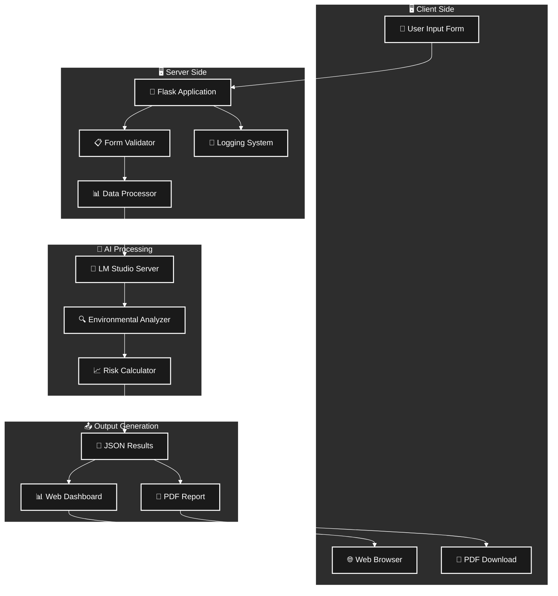

#### Data Flow Architecture


### 🚀 Quick Start

#### 🖥️ Local Development

1. **Clone the Repository**
   ```bash
   git clone <repository-url>
   cd EcoImpact-AI
   ```

2. **Install Dependencies**
   ```bash
   pip install -r requirements.txt
   ```

3. **Setup LM Studio**
   - Download and install [LM Studio](https://lmstudio.ai/)
   - Load an AI model suitable for text analysis
   - Start the local server on `http://127.0.0.1:1234`
   - Follow our detailed [LM Studio Setup Guide](LM_STUDIO_SETUP_GUIDE.md)

4. **Run the Application**
   ```bash
   python app.py
   ```

5. **Access the Web Interface**
   - Open your browser and go to `http://127.0.0.1:5000`
   - Fill in the mining project details
   - Get instant AI-powered environmental impact assessment!

#### 🚂 Deploy to Railway (Production)

Deploy your application to the cloud in minutes!

1. **Quick Deploy**
   ```bash
   git add .
   git commit -m "Ready for Railway deployment"
   git push origin main
   ```

2. **Setup on Railway**
   - Visit [railway.app](https://railway.app) and login with GitHub
   - Create new project → Deploy from GitHub repo
   - Select your repository

3. **Configure Environment**
   - Add environment variable: `AI_MODEL_URL`
   - Example: `https://api.groq.com/openai/v1/chat/completions`
   - Or deploy your own AI model on a separate service

4. **Done!** 🎉
   - Railway automatically builds and deploys
   - Access your app at `https://your-app.up.railway.app`

📚 **Detailed guides:**
- [Railway Deployment Guide](RAILWAY_DEPLOYMENT_GUIDE.md) - Full documentation
- [Railway Quick Start (RU)](RAILWAY_QUICK_START_RU.md) - Быстрый старт на русском

### 📊 Risk Assessment Methodology

#### Environmental Risk Categories
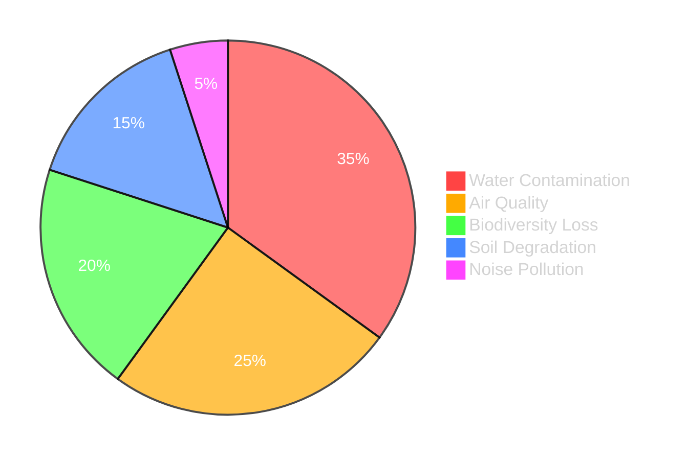

#### Risk Scoring System
```mermaid
%%{init: {'theme':'dark', 'themeVariables': {'primaryColor':'#1a1a1a','primaryTextColor':'#ffffff','primaryBorderColor':'#ffffff','lineColor':'#ffffff','secondaryColor':'#2d2d2d','tertiaryColor':'#404040','background':'#1a1a1a','mainBkg':'#1a1a1a','secondBkg':'#2d2d2d','tertiaryBkg':'#404040'}}}%%
graph LR
    subgraph Scoring["📊 Risk Score Levels"]
        A["0-2: 🟢 Low Risk"]
        B["3-4: 🟡 Moderate Risk"]
        C["5-6: 🟠 Medium Risk"]
        D["7-8: 🔴 High Risk"]
        E["9-10: 🚨 Critical Risk"]
    end
    
    subgraph Factors["🔍 Assessment Factors"]
        F1["📍 Location Sensitivity"]
        F2["⚖️ Project Scale"]
        F3["⏱️ Duration"]
        F4["🌿 Ecosystem Type"]
        F5["💧 Water Proximity"]
    end
    
    Factors --> Scoring
    
    style A fill:#1a1a1a,stroke:#4caf50,stroke-width:3px,color:#ffffff
    style B fill:#1a1a1a,stroke:#ffeb3b,stroke-width:3px,color:#ffffff
    style C fill:#1a1a1a,stroke:#ff9800,stroke-width:3px,color:#ffffff
    style D fill:#1a1a1a,stroke:#f44336,stroke-width:3px,color:#ffffff
    style E fill:#1a1a1a,stroke:#9c27b0,stroke-width:3px,color:#ffffff
    style F1 fill:#1a1a1a,stroke:#ffffff,stroke-width:2px,color:#ffffff
    style F2 fill:#1a1a1a,stroke:#ffffff,stroke-width:2px,color:#ffffff
    style F3 fill:#1a1a1a,stroke:#ffffff,stroke-width:2px,color:#ffffff
    style F4 fill:#1a1a1a,stroke:#ffffff,stroke-width:2px,color:#ffffff
    style F5 fill:#1a1a1a,stroke:#ffffff,stroke-width:2px,color:#ffffff
    style Scoring fill:#2d2d2d,stroke:#ffffff,stroke-width:3px,color:#ffffff
    style Factors fill:#2d2d2d,stroke:#ffffff,stroke-width:3px,color:#ffffff
```

#### Sample Risk Analysis Results
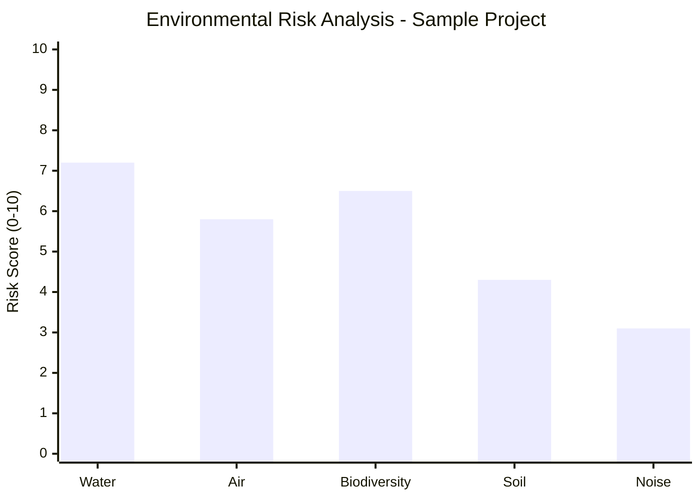

#### AI Processing Timeline
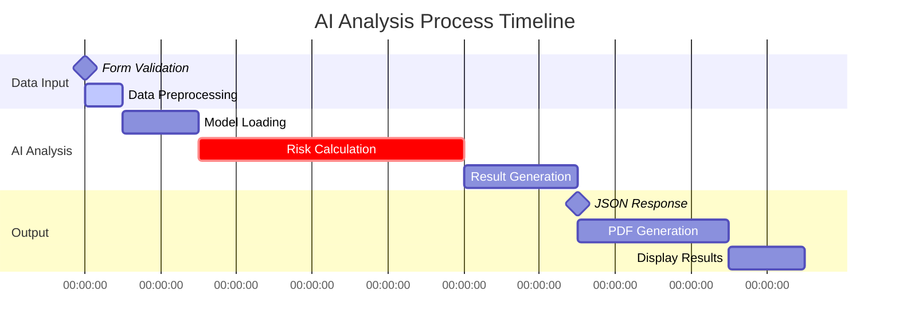

#### Processing Speed Breakdown
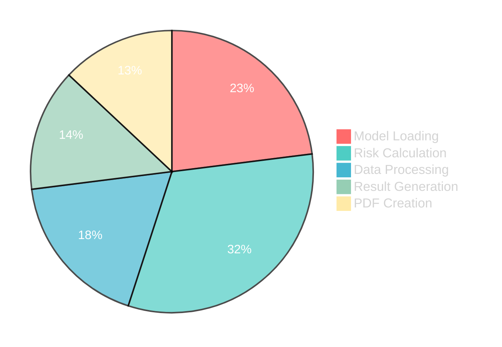

#### System Response Flow
```mermaid
%%{init: {'theme':'dark', 'themeVariables': {'primaryColor':'#1a1a1a','primaryTextColor':'#ffffff','primaryBorderColor':'#ffffff','lineColor':'#ffffff','secondaryColor':'#2d2d2d','tertiaryColor':'#404040','background':'#1a1a1a','mainBkg':'#1a1a1a','secondBkg':'#2d2d2d','tertiaryBkg':'#404040'}}}%%
flowchart LR
    A["⏱️ 0s<br/>User Submit"] --> B["⏱️ 2s<br/>Data Validated"]
    B --> C["⏱️ 5s<br/>Model Ready"]
    C --> D["⏱️ 12s<br/>AI Analysis"]
    D --> E["⏱️ 15s<br/>Results Ready"]
    E --> F["⏱️ 20s<br/>PDF Generated"]
    F --> G["⏱️ 22s<br/>Complete"]
    
    style A fill:#1a1a1a,stroke:#ff5722,stroke-width:3px,color:#ffffff
    style B fill:#1a1a1a,stroke:#ffffff,stroke-width:2px,color:#ffffff
    style C fill:#1a1a1a,stroke:#ffc107,stroke-width:3px,color:#ffffff
    style D fill:#1a1a1a,stroke:#4caf50,stroke-width:3px,color:#ffffff
    style E fill:#1a1a1a,stroke:#ffffff,stroke-width:2px,color:#ffffff
    style F fill:#1a1a1a,stroke:#ffffff,stroke-width:2px,color:#ffffff
    style G fill:#1a1a1a,stroke:#2196f3,stroke-width:3px,color:#ffffff
```

### 📈 Usage Examples

#### Input Parameters
- **Project Location**: GPS coordinates or region name
- **Mining Type**: Surface mining, underground, etc.
- **Resource Type**: Coal, metals, minerals
- **Project Scale**: Small, medium, large operations
- **Environmental Sensitivity**: Nearby water sources, protected areas

#### Sample Output
```json
{
  "overall_risk_score": 6.8,
  "summary": "The proposed mining operation presents moderate to high environmental risks...",
  "risks": [
    {
      "category": "Water Contamination",
      "score": 7.2,
      "details": "High risk due to proximity to groundwater sources..."
    }
  ]
}
```

### 📸 Suggested Photos and Illustrations

**For documentation and presentation:**

1. **Screenshots needed:**
   - Main web interface with form fields
   - Results page showing risk scores and analysis
   - PDF report example
   - AI model configuration in LM Studio

2. **Diagrams to create:**
   - System architecture flowchart
   - Environmental impact assessment process
   - Risk scoring methodology visualization
   - Data flow between components

3. **Additional visual elements:**
   - Before/after environmental impact comparisons
   - Charts showing different risk levels
   - Mining operation types illustrated
   - Environmental protection infographics

### 🏆 Educational Value

This project demonstrates:
- **STEM Integration**: Combining computer science, environmental science, and mathematics
- **Real-World Problem Solving**: Addressing actual environmental challenges
- **AI Applications**: Practical use of machine learning in environmental protection
- **Web Development Skills**: Full-stack development experience
- **Data Analysis**: Working with complex environmental datasets

### 🌟 Future Enhancements

- 🗺️ **Interactive Maps**: Visualize mining locations and environmental risks
- 📱 **Mobile App**: Extend access to field researchers
- 🌍 **Multi-language Support**: Expand to more languages
- 📊 **Advanced Analytics**: Historical trend analysis
- 🤝 **API Integration**: Connect with external environmental databases

### 👥 Team

Developed with ❤️ by 9th-grade students participating in a project competition.

### 📄 License

This project is licensed under the MIT License - see the [LICENSE](LICENSE) file for details.

---

## 🇷🇺 Русская версия

### 📖 О проекте

**ЭкоВлияние ИИ** — это инновационное веб-приложение, разработанное учениками 9 класса для конкурса проектов. Наш инструмент использует искусственный интеллект для оценки воздействия горнодобывающих операций и проектов разработки минеральных ресурсов на окружающую среду.

Приложение анализирует различные факторы, такие как:
- 💧 **Риски загрязнения воды**
- 🌬️ **Ухудшение качества воздуха**
- 🌱 **Воздействие на землю и биоразнообразие**

Наша модель ИИ предоставляет комплексные оценки рисков и подробные отчёты, помогая инженерам-экологам и лицам, принимающим решения, делать осознанный выбор в отношении горнодобывающих проектов.

### 🎯 Цели проекта

- Создать доступный инструмент для оценки воздействия на окружающую среду
- Продемонстрировать возможности ИИ в области защиты окружающей среды
- Обеспечить образовательную ценность в области устойчивых методов добычи
- Показать, как технологии могут поддержать сохранение окружающей среды

### ✨ Ключевые возможности

- 🤖 **Анализ на основе ИИ**: Продвинутое машинное обучение для оценки экологических рисков
- 📊 **Система оценки рисков**: Численные оценки от 0 до 10 для различных экологических факторов
- 📄 **Генерация PDF-отчётов**: Профессиональные отчёты для заинтересованных сторон
- 🌐 **Удобный интерфейс**: Простой веб-интерфейс, доступный каждому
- 📈 **Обработка в реальном времени**: Мгновенный анализ и результаты
- 🔍 **Подробные разбивки**: Анализ воздействия на окружающую среду по категориям

### 🛠️ Технологический стек

| Компонент | Технология | Назначение |
|-----------|------------|------------|
| **Бэкенд** | Python Flask | Фреймворк веб-приложения |
| **Модель ИИ** | LM Studio (Локально) | ИИ для экологического анализа |
| **Фронтенд** | HTML/CSS/JavaScript | Пользовательский интерфейс |
| **Генерация PDF** | WeasyPrint | Создание отчётов |
| **Логирование** | Python logging | Мониторинг приложения |

### 🚀 Быстрый старт

#### 🖥️ Локальная разработка

1. **Клонирование репозитория**
   ```bash
   git clone <repository-url>
   cd EcoImpact-AI
   ```

2. **Установка зависимостей**
   ```bash
   pip install -r requirements.txt
   ```

3. **Настройка LM Studio**
   - Скачайте и установите [LM Studio](https://lmstudio.ai/)
   - Загрузите модель ИИ, подходящую для анализа текста
   - Запустите локальный сервер на `http://127.0.0.1:1234`
   - Следуйте нашему подробному [Руководству по настройке LM Studio](LM_STUDIO_SETUP_GUIDE.md)

4. **Запуск приложения**
   ```bash
   python app.py
   ```

5. **Доступ к веб-интерфейсу**
   - Откройте браузер и перейдите на `http://127.0.0.1:5000`
   - Заполните детали горнодобывающего проекта
   - Получите мгновенную оценку воздействия на окружающую среду на основе ИИ!

#### 🚂 Развертывание на Railway (Продакшн)

Разверните приложение в облаке за несколько минут!

1. **Быстрое развертывание**
   ```bash
   git add .
   git commit -m "Готово к развертыванию на Railway"
   git push origin main
   ```

2. **Настройка на Railway**
   - Перейдите на [railway.app](https://railway.app) и войдите через GitHub
   - Создайте новый проект → Deploy from GitHub repo
   - Выберите ваш репозиторий

3. **Настройка переменных окружения**
   - Добавьте переменную окружения: `AI_MODEL_URL`
   - Пример: `https://api.groq.com/openai/v1/chat/completions`
   - Или разверните собственную модель ИИ на отдельном сервисе

4. **Готово!** 🎉
   - Railway автоматически соберёт и развернёт приложение
   - Доступ к приложению по адресу `https://your-app.up.railway.app`

📚 **Подробные руководства:**
- [Railway Deployment Guide](RAILWAY_DEPLOYMENT_GUIDE.md) - Полная документация (EN)
- [Railway Quick Start (RU)](RAILWAY_QUICK_START_RU.md) - Быстрый старт на русском

### 📊 Примеры использования

#### Входные параметры
- **Местоположение проекта**: GPS-координаты или название региона
- **Тип добычи**: Открытая разработка, подземная добыча и др.
- **Тип ресурса**: Уголь, металлы, минералы
- **Масштаб проекта**: Малые, средние, крупные операции
- **Экологическая чувствительность**: Близлежащие водные источники, охраняемые территории

### 🏆 Образовательная ценность

Этот проект демонстрирует:
- **Интеграцию STEM**: Сочетание информатики, экологии и математики
- **Решение реальных проблем**: Обращение к актуальным экологическим вызовам
- **Применение ИИ**: Практическое использование машинного обучения в защите окружающей среды
- **Навыки веб-разработки**: Опыт полноценной разработки
- **Анализ данных**: Работа со сложными экологическими наборами данных

### 🌟 Будущие улучшения

- 🗺️ **Интерактивные карты**: Визуализация местоположений добычи и экологических рисков
- 📱 **Мобильное приложение**: Расширение доступа для полевых исследователей
- 🌍 **Многоязычная поддержка**: Расширение на большее количество языков
- 📊 **Продвинутая аналитика**: Анализ исторических тенденций
- 🤝 **Интеграция API**: Подключение к внешним экологическим базам данных

### 👥 Команда

Разработано с ❤️ учениками 9 класса, участвующими в конкурсе проектов.

### 📄 Лицензия

Этот проект лицензирован под лицензией MIT — см. файл [LICENSE](LICENSE) для подробностей.

---

## 📊 Project Statistics & Performance | Статистика проекта и производительность

### Development Metrics
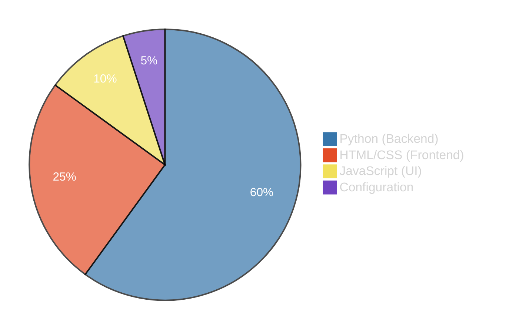

### Project Timeline
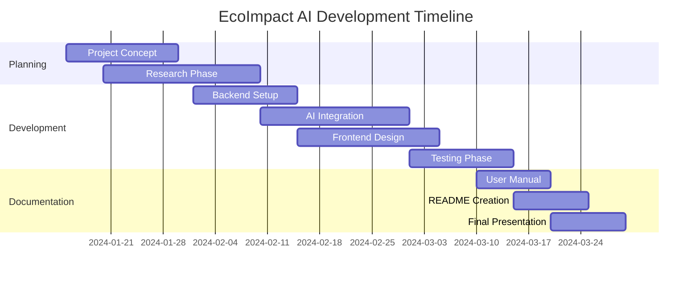

### Performance Metrics
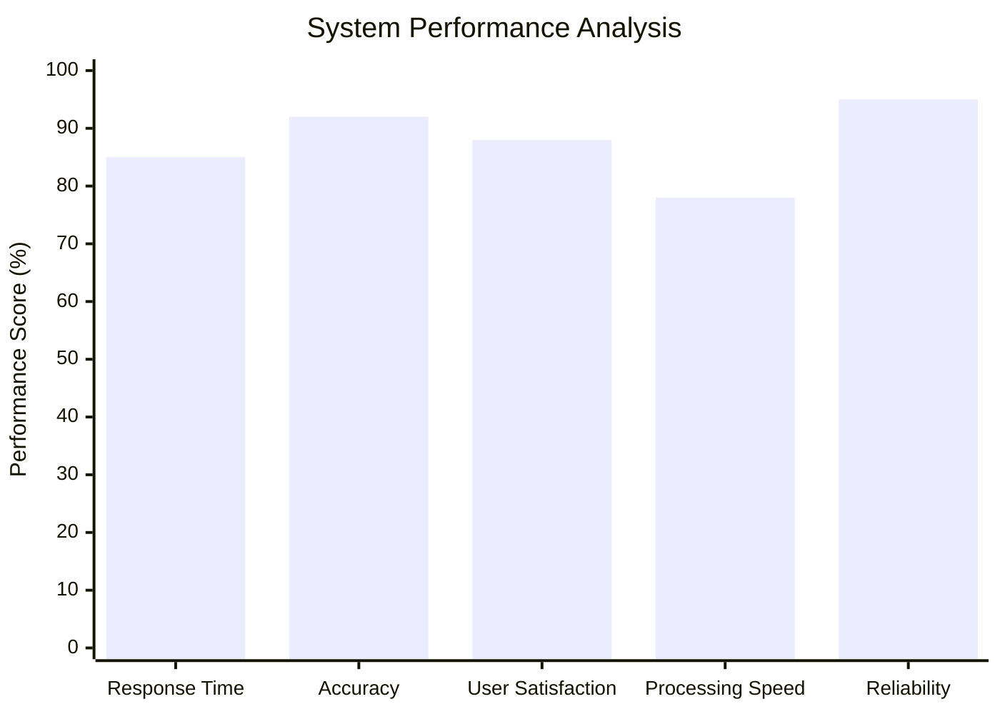

### Technology Stack Usage
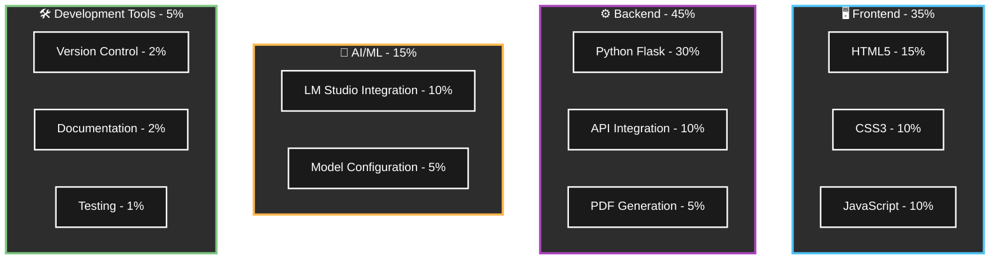

### Key Project Statistics

| Metric | Value | Details |
|--------|-------|---------|
| **📝 Lines of Code** | ~1,200+ | Well-structured and documented |
| **🌐 Languages** | 4 | Python, HTML, CSS, JavaScript |
| **📦 Dependencies** | 8 | Flask, WeasyPrint, Requests, etc. |
| **⏱️ Development Time** | 3 months | Full academic semester project |
| **👥 Team Size** | 2-4 students | 9th grade high school team |
| **🎯 Target Audience** | Environmental engineers, researchers, students |
| **🔧 Features** | 6 major | AI analysis, PDF reports, web interface, etc. |
| **📊 Risk Categories** | 5 types | Water, Air, Biodiversity, Soil, Noise |
| **🧪 Test Cases** | 20+ | Comprehensive testing scenarios |
| **📱 Platforms** | Cross-platform | Windows, macOS, Linux compatible |

### Environmental Impact Categories Analysis
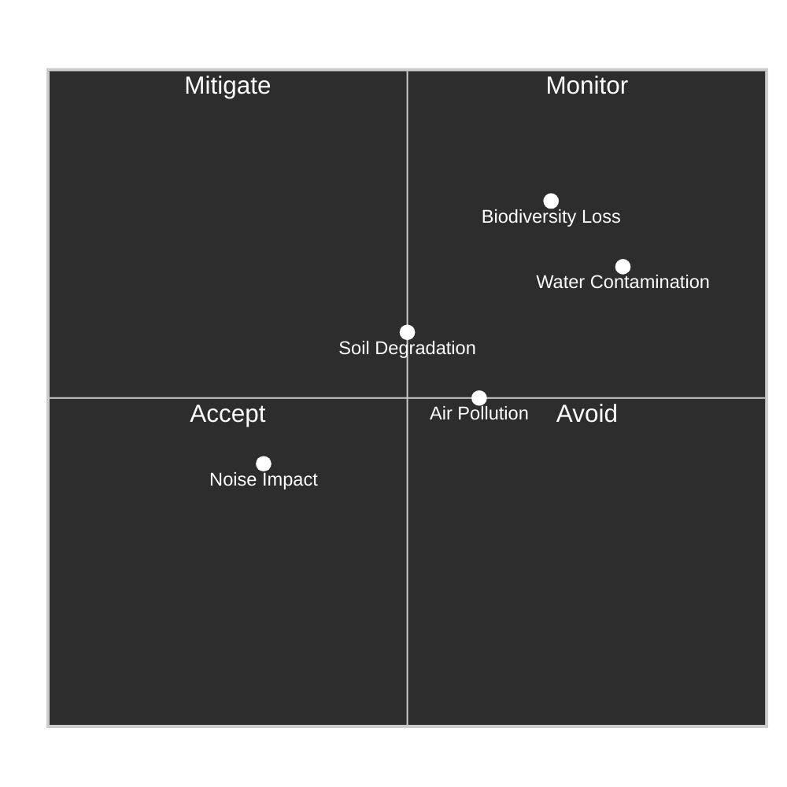

---

## 🤝 Contributing | Участие в разработке

We welcome contributions from the community! Please see our contribution guidelines for more information.

Мы приветствуем участие сообщества в разработке! Пожалуйста, ознакомьтесь с нашими рекомендациями для участников.

---

*This project was created as part of a high school STEM education initiative to promote environmental awareness through technology.*

*Этот проект был создан в рамках инициативы STEM-образования в средней школе для повышения экологической осведомлённости через технологии.*
## 📞 Contact | Контакты

For questions about this project, please contact the development team.

По вопросам об этом проекте обращайтесь к команде разработчиков.

---

*This project was created as part of a high school STEM education initiative to promote environmental awareness through technology.*

*Этот проект был создан в рамках инициативы STEM-образования в средней школе для повышения экологической осведомлённости через технологии.*
